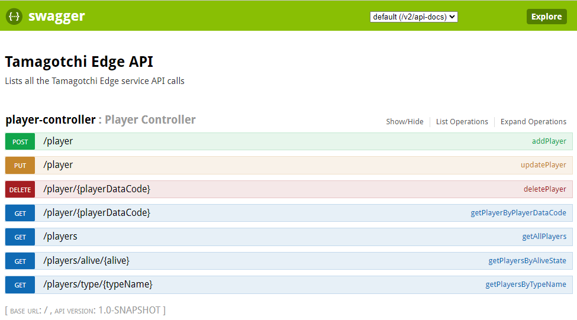
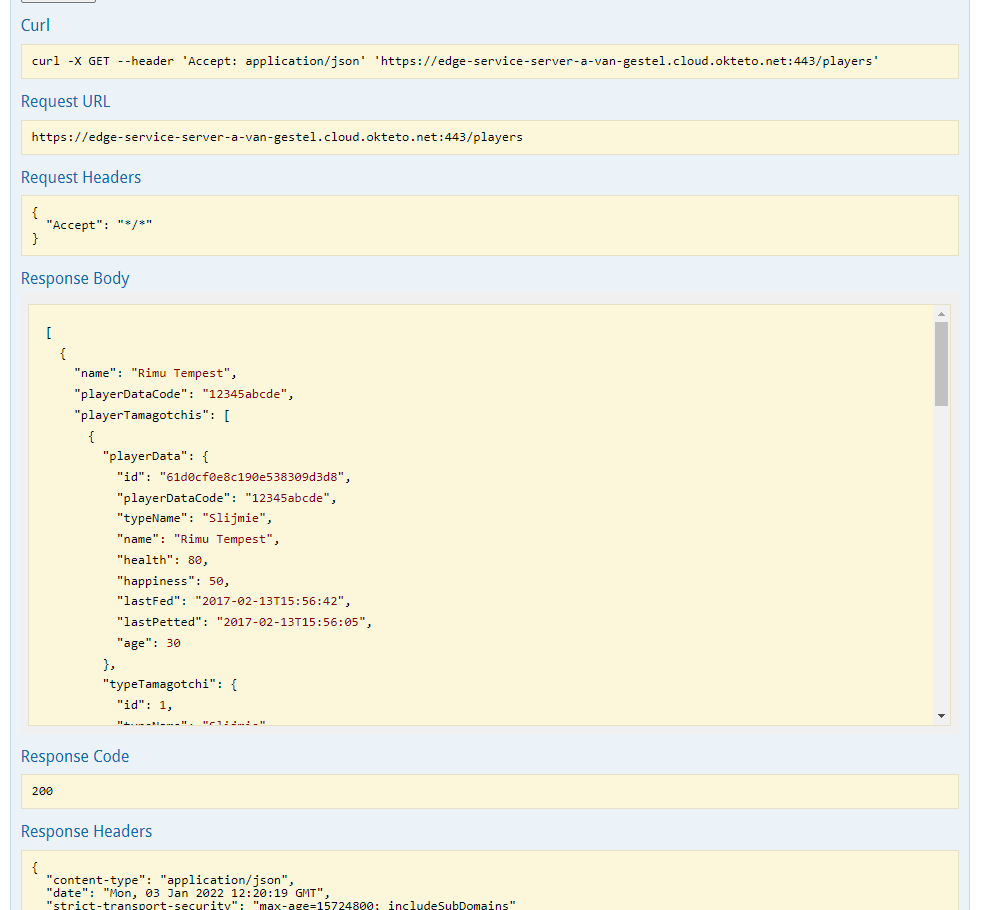
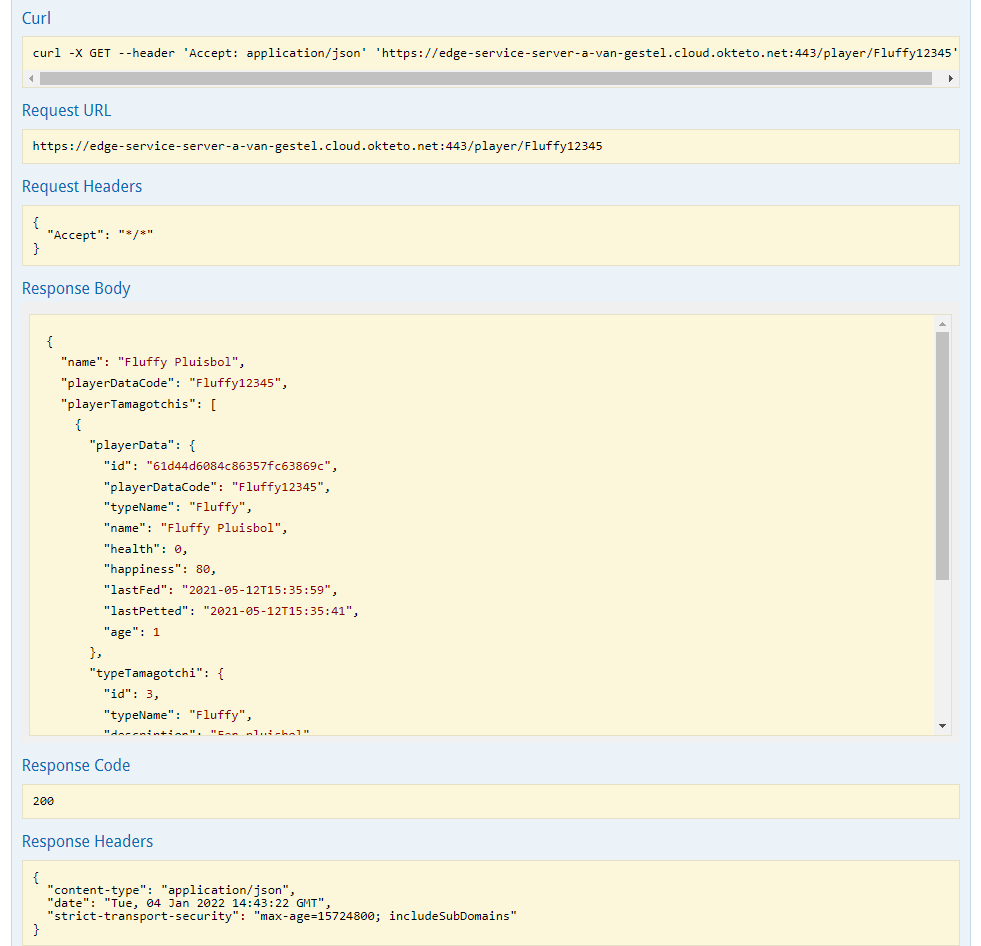
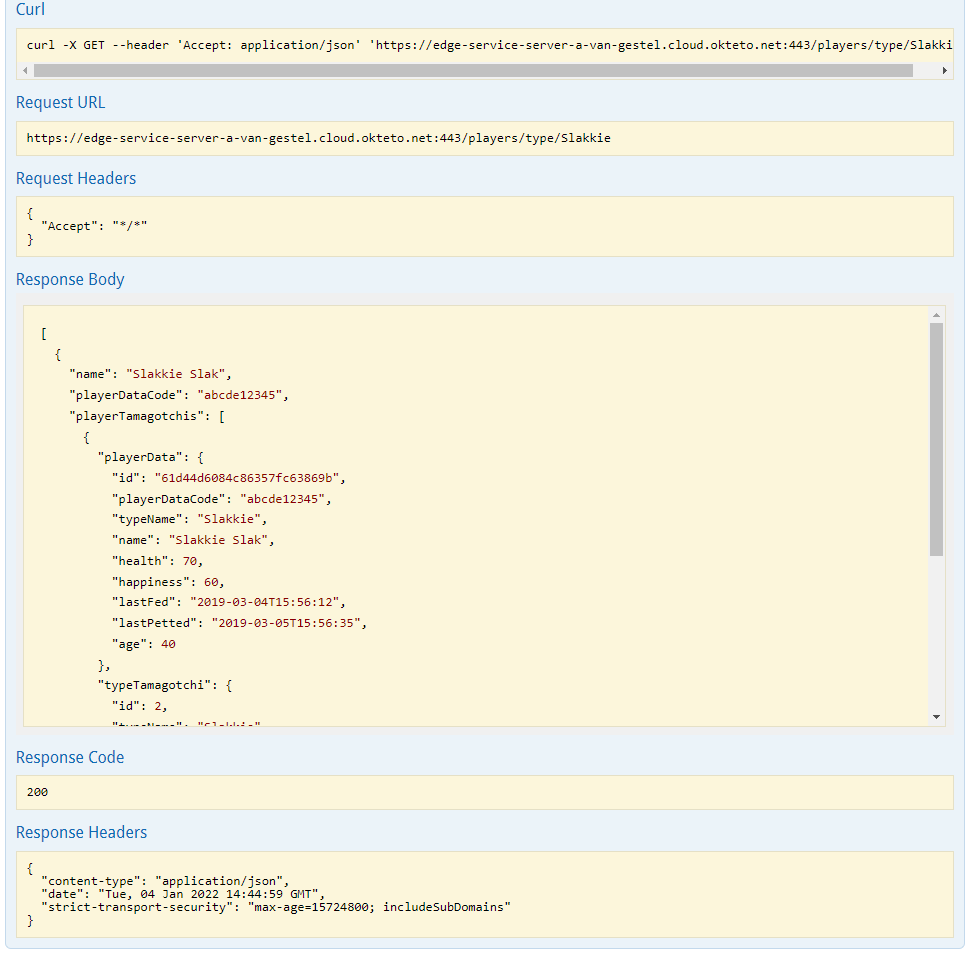
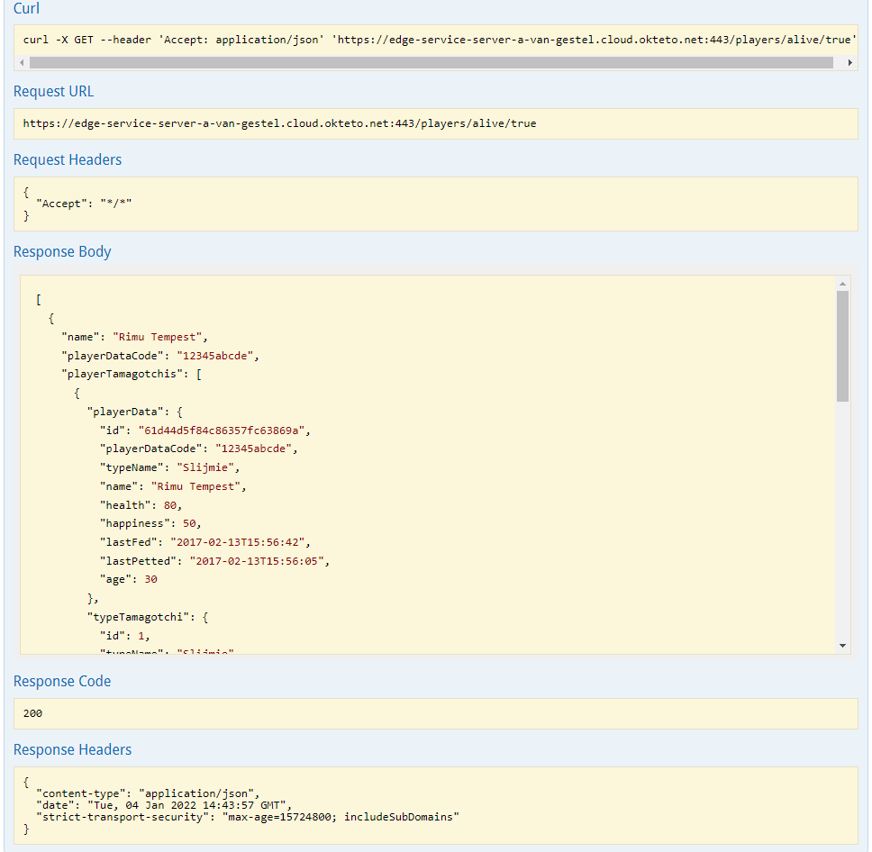
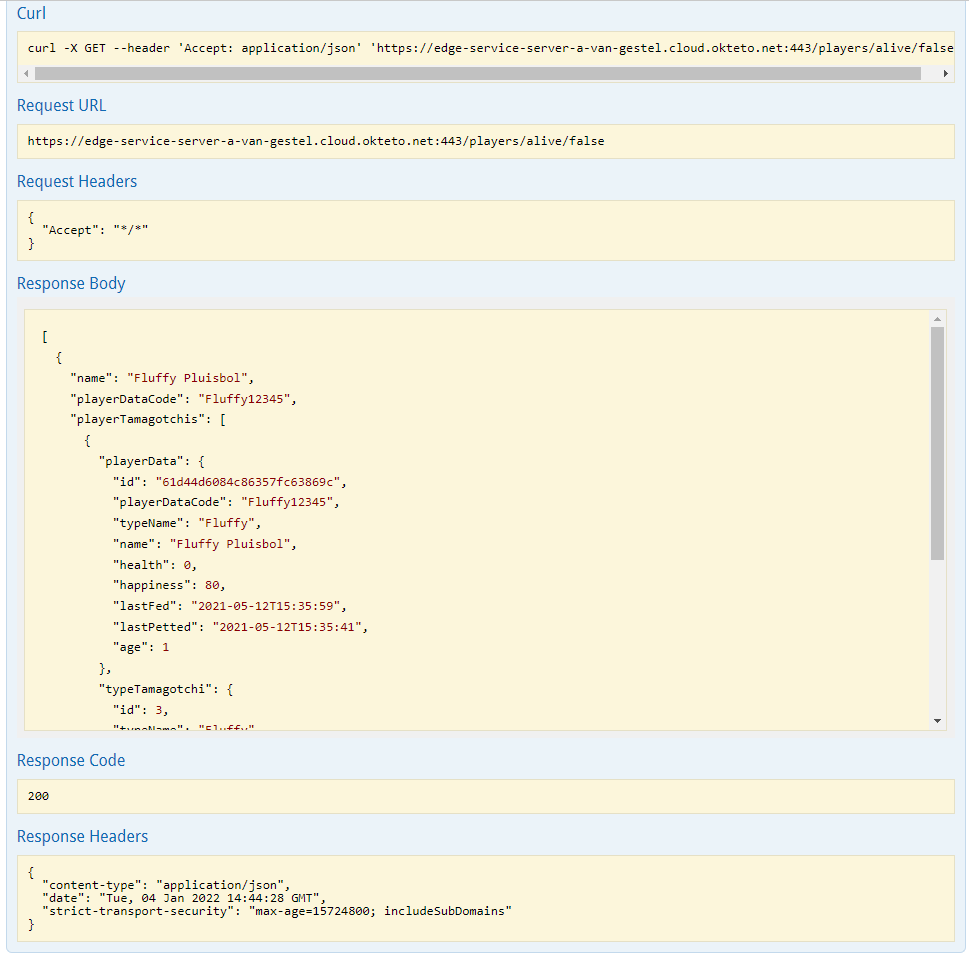

# 3APP01 | APT | Edge Microservice

## Teamleden
* [Sten Neyrinck](https://github.com/stenneyrinck)
* [Axel Van Gestel](https://github.com/A-Van-Gestel)

## Thema
We zijn van plan een tamagotchi te maken, hierbij worden dan de soorten tamagotchi en de gegevens van de tamagotchi van de speler met behulp van de microservices beheerd.

## Backend repo's
* [PlayerData Microservice (MongoDB)](https://github.com/A-Van-Gestel/3APP01-APT-Back_PlayerData_Microservice) ([SonarCloud](https://sonarcloud.io/summary/new_code?id=A-Van-Gestel_3APP01-APT-Back_PlayerData_Microservice))
* [Types Tamagotchi Microservice (MariaDB)](https://github.com/stenneyrinck/3APP01-APT-Back_TypesTomagotchi_Microservice) ([SonarCloud](https://sonarcloud.io/summary/new_code?id=stenneyrinck_3APP01-APT-Back_TypesTomagotchi_Microservice))

## Kubernetes Service URL's
Opent de Swagger-UI pagina van elke service, elke service draait in de cloud via Okteto.
* [Edge Microservice](https://edge-service-server-a-van-gestel.cloud.okteto.net/swagger-ui.html)
* [PlayerData Microservice (MongoDB)](https://playerdata-service-server-a-van-gestel.cloud.okteto.net/swagger-ui.html)
* [Types Tamagotchi Microservice (MariaDB)](https://type-tamagotchi-service-server-a-van-gestel.cloud.okteto.net/swagger-ui.html)

## Diagram Microservices Architectuur

## Swagger-UI Edge Microservice
### The Requests

### GET Players output

### GET Player by playerDataCode output

### GET Player by typeName output

### GET Player by alive (true) output

### GET Player by alive (false) output
